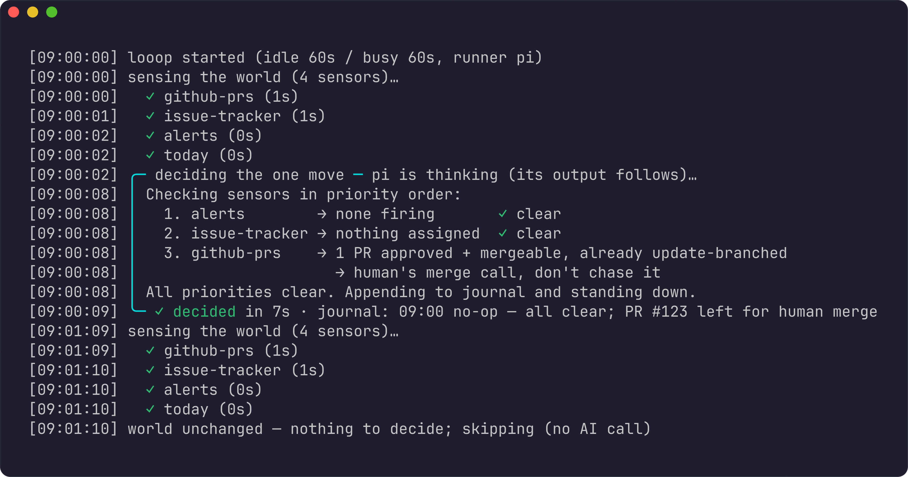

# looop

A tiny, portable, Kubernetes-shaped control loop for your work.

`looop` watches the things you care about (GitHub, Linear, Grafana, …), and once
per beat asks an LLM to make **exactly one move** toward your goals — then stops.
It's a single self-contained binary with no daemon, no database, no server.



One full beat (sense → decide → journal), then the next beat skips the LLM
entirely because nothing in the world changed.

## How it works

Like a Kubernetes controller, every **tick** reconciles *desired state* against
*observed state* and takes one step to close the gap:

```
       ┌─────────────────────────────────────────────┐
       │  sense → diff → decide ONE move → act → log   │
       └─────────────────────────────────────────────┘
                          one tick

1. SENSE    run every sensors/*.sh → each prints one JSON snapshot of the world
2. DIFF     hash (PLAYBOOK + goals + snapshots + workers). Unchanged since
            last tick? → skip, no LLM call (cheap, level-triggered)
3. DECIDE   hand the PLAYBOOK + goals + snapshots + live workers to the LLM;
            it picks THE single most important move
4. ACT      a small reversible action, edit a goal/sensor, or start a worker
5. LOG      append one line to journal.md, surface anything that needs you
```

Each tick is **stateless and disposable**: the process carries nothing in
memory between beats — all state lives in files (goals, snapshots, journal,
claims). Because of that the loop is **level-triggered**, not edge-triggered:
every tick re-derives what to do from the *current* world (snapshots are wiped
and re-sensed each beat), so a crashed tick, renamed sensor, or dead worker just
self-heals on the next beat. Kill the pulse anytime; the next tick picks up
exactly where the world is, not where a remembered cursor left off.

## Concepts

Everything lives as plain files in the data dir (the loop's memory):

| File / dir      | Role (Kubernetes analogy)                                          |
| --------------- | ------------------------------------------------------------------ |
| `PLAYBOOK.md`   | the controller logic — your judgment, priorities, guardrails       |
| `goals/*.md`    | desired state — one declarative spec per thing you're pushing      |
| `sensors/*.sh`  | observers — each prints **one JSON object** describing the world   |
| `journal.md`    | the action log — one line per move                                 |
| `claims/`       | leases — a worker writes one to *own* a task; stale ones auto-reap |
| `reports/`      | deliverables a human reads (persists across ticks)                 |

**Workers** are the hands. When a move needs real, multi-step work, the loop
spawns an agent session that runs detached, in parallel, and reconciles its task
on its own. Workers
that touch code provision their own sandbox first; the loop itself knows nothing
about repos.

**Humans in the loop.** Workers never guess and never send OS notifications.
When one needs a decision it raises a flag and waits; the pulse pops a tmux
window you can't miss. You attach, answer, and it continues. Irreversible
actions (merges, deploys, deletes) always require your explicit approval.

## Quick start

```sh
looop up            # start the pulse as a background service (looop down to stop)
looop up --watch    # start it and follow its output (Ctrl-C stops watching, not the pulse)
looop watch pulse   # follow a running pulse's output any time
```

The pulse always runs detached now (supervised in the background) — there is no foreground
`looop run`. Watch it live with `looop up --watch` / `looop watch pulse`, or add
`--json` for a machine-readable NDJSON stream.

On the first run the loop seeds a starter PLAYBOOK and a `setup` goal whose only
job is to **interview you** and rewrite the PLAYBOOK, goals, and sensors to match
your real work. After that it just runs.

## Commands

```sh
looop up [--watch] [--json]    run the pulse as a detached background service
                               (--watch follows it; --json = NDJSON output)
looop down                     stop the detached pulse service
looop watch <id>               follow a session's output read-only (tail -f);
                               `looop watch pulse` watches the loop itself
looop tick                     run a single beat and exit (debug / cron)
looop status [--json]          structured snapshot of the loop's live state
                               (for an external observer / AI watching it)
looop ls [--watch]             list this profile's worker sessions (⚑ = waiting)
looop log <id> [--tail N] [--grep RE] [--follow] [--json]
                               show / tail / grep / follow a session's output
looop shot <id> [--ansi|--json]   render a session's current visible screen
looop send <id> <text...>      type text into a session's stdin
looop key <id> <KEY...>        send named keys (Enter, Up, C-c, …)
looop expect <id> <REGEX>      block until a regex appears (exit 124 on timeout)
looop wait <id> | wait-idle <id>  block until exit / until output is quiet
looop resize <id> <COLSxROWS>  resize a session's terminal
looop attach <id> | detach <id>   attach/force-detach a terminal (Ctrl-\ Ctrl-\)
looop restart <id>             restart a worker's wrapped command
looop kill|flag|unflag <id>    manage a worker; looop prune clears finished ones
looop cost [today|all|--json]  report LLM spend from the cost ledger
looop config zsh|bash          print shell integration (tab completions)
looop version | help           (looop help = the full design manual)
```

## Shell integration

```sh
# Zsh (~/.zshrc)
eval "$(looop config zsh)"

# Bash (~/.bashrc)
eval "$(looop config bash)"
```

This adds tab completion for every subcommand plus dynamic completion for
`looop attach|kill|flag|unflag <id>` (this profile's live worker sessions).
Completions resolve `LOOOP_DATA_DIR` the same way the binary does, so an isolated
profile completes its own sessions.

To change judgment: edit `PLAYBOOK.md` — it takes effect next tick.

## Install

### curl (recommended)

Downloads a prebuilt binary from GitHub Releases — **no Rust toolchain needed**:

```sh
curl -fsSL https://raw.githubusercontent.com/yusukeshib/looop/main/install.sh | bash
```

Installs `looop` to `~/.local/bin/looop` (override with `LOOOP_INSTALL_DIR`). The
script falls back to `cargo install` / `nix profile install` if no prebuilt
binary matches your platform. Make sure the install dir is on your `PATH`:

```sh
export PATH="$HOME/.local/bin:$PATH"
```

### Cargo

```sh
cargo install looop
```

### Nix (flakes)

```sh
nix run github:yusukeshib/looop                 # run without installing
nix profile install github:yusukeshib/looop     # install into your profile
nix develop github:yusukeshib/looop             # dev shell (cargo, clippy, rustfmt)
```

### From git (latest `main`)

```sh
cargo install --git https://github.com/yusukeshib/looop.git --locked looop
```

### Verify

```sh
looop version   # -> looop 0.1.0
looop help
```

Runtime deps: just an LLM runner (`pi` or `claude`). looop is a single
self-contained binary — spawning, listing, attaching, killing, flagging and
pruning worker sessions all run in-process, no extra executable required.
Sessions are stored under `$LOOOP_DATA_DIR/sessions`, self-contained per profile:
looop sets no extra environment and shares no global state, and session ids are
bare (the pulse is `pulse`). (Workers that touch code also need `git` or `box`
to sandbox themselves, but that's a worker concern, not a prerequisite for the
pulse.)

## Config & data

- **Config** — `$XDG_CONFIG_HOME/looop.json` (override `LOOOP_CONFIG`). One file:
  runner wiring and tick cadence. Default runner is `pi`; `claude` is built in.
- **Data / memory** — `$XDG_STATE_HOME/looop/` (override `LOOOP_DATA_DIR`). A git
  repo holding the PLAYBOOK, goals, journal, and sensors. Worker and pulse
  sessions live under `sessions/` in the same dir, so a profile is fully
  self-contained. Pointing `LOOOP_DATA_DIR` elsewhere gives you an isolated
  **profile** with its own sessions.

LLM spend is metered automatically (ticks and self-reporting workers) into an
append-only ledger; see `looop cost`.
